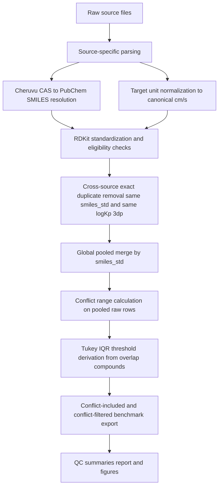

# Benchmark Build Report

## Task overview
- `run_merge.py` performed raw source parsing, structure standardization, exact duplicate removal, global pooled merge, conflict handling, and final export.
- The final identity is `smiles_std` (canonical isomeric SMILES).
- The final target unit is `log10(Kp in cm/s)`.

## Input raw files
- `data_raw/huskinDB.xlsx`
- `data_raw/SkinPix_20230620_cleanedDB.xlsx`
- `data_raw/Zeng et al.xlsx`
- `data_raw/Cheruvu et al.xlsx`
- `data_raw/deeppk_skin_permeability_train.csv`
- `data_raw/deeppk_skin_permeability_val.csv`
- `data_raw/deeppk_skin_permeability_test.csv`

## Source references
- `huskin`: Waters, Laura J., and Xin Ling Quah. "Predicting skin permeability using HuskinDB." Scientific Data 9.1 (2022): 584.
- `skinpix`: Chedik, Lisa, et al. "An update of skin permeability data based on a systematic review of recent research." Scientific Data 11.1 (2024): 224.
- `zeng`: Zeng, R., Deng, J., Dang, L. et al. Correlation between the structure and skin permeability of compounds. Sci Rep 11, 10076 (2021).
- `cheruvu`: H. S. Cheruvu et al., An updated database of human maximum skin fluxes and epidermal permeability coefficients for drugs, xenobiotics, and other solutes applied as aqueous solutions, Data in Brief, 42, 108242 (2022).
- `deeppk`: Myung, Y., et al. Deep-PK: deep learning for small molecule pharmacokinetic and toxicity prediction, 52, 469-475 (2024).

## Applied config
- `identity_key`: `smiles_std`
- `round_target_decimals`: `3`
- `canonical_target_unit`: `cm/s`
- `conflict_threshold_method`: `tukey_iqr_1.5`
- `exclude_mixtures_and_salts`: `True`
- `exclude_metal_containing_structures`: `True`

## Benchmark Construction Flow


| step                                    | description                                                                                                                         | major_output                                                  |
| --------------------------------------- | ----------------------------------------------------------------------------------------------------------------------------------- | ------------------------------------------------------------- |
| 1. Parse raw sources                    | Source-specific parsers detect headers, map columns, and preserve row-level provenance.                                             | source-level parsed tables                                    |
| 2. Resolve Cheruvu CAS                  | Cheruvu rows use CAS -> PubChem resolution before structure eligibility is finalized.                                               | resolved or explicitly unresolved Cheruvu rows                |
| 3. Standardize structures               | RDKit generates canonical isomeric SMILES and computes structure-valid / benchmark-eligible flags.                                  | standardized source tables                                    |
| 4. Remove exact cross-source duplicates | Rows with the same smiles_std and logKp rounded to 3 decimals across multiple sources are treated as duplicate literature evidence. | publication duplicate annotations and removed-row audit table |
| 5. Global pooled merge                  | Remaining eligible raw rows are merged by smiles_std and pooled median logKp is computed.                                           | global pooled benchmark table                                 |
| 6. Derive conflict cutoff               | Overlap compounds define the pooled conflict-range distribution, and Tukey 1.5xIQR sets the main conflict threshold.                | derived conflict threshold and conflict flags                 |
| 7. Export report and figures            | Final datasets, QC summaries, manuscript-oriented figures, and markdown report are written to disk.                                 | outputs/final and reports/benchmark_build_report.md           |

## Terminology
| term                         | definition                                                                                                                                                |
| ---------------------------- | --------------------------------------------------------------------------------------------------------------------------------------------------------- |
| raw_rows                     | Total rows read by the parser before RDKit-based structure checks.                                                                                        |
| valid_rows                   | Rows where RDKit successfully parsed smiles_raw and generated smiles_std.                                                                                 |
| eligible_rows                | Rows that satisfy benchmark inclusion rules: structure-valid, single-fragment, no metal, target present; Cheruvu also requires successful CAS resolution. |
| exact cross-source duplicate | Rows from different sources with the same smiles_std and the same target_logkp rounded to 3 decimals.                                                     |
| pooled benchmark row         | A compound-level representative built from all remaining eligible raw rows after exact duplicate removal.                                                 |
| conflict_range               | Range of pooled raw-row logKp values for the same smiles_std after duplicate removal.                                                                     |

## Source preprocessing summary: raw -> valid -> eligible
| source  | raw_rows | raw_unique_smiles | valid_rows | valid_unique_smiles | eligible_rows | eligible_unique_smiles |
| ------- | -------- | ----------------- | ---------- | ------------------- | ------------- | ---------------------- |
| cheruvu | 478      | 139               | 467        | 138                 | 461           | 134                    |
| deeppk  | 186      | 186               | 186        | 186                 | 186           | 186                    |
| huskin  | 550      | 253               | 550        | 253                 | 541           | 246                    |
| skinpix | 202      | 110               | 202        | 110                 | 194           | 104                    |
| zeng    | 274      | 272               | 274        | 271                 | 274           | 271                    |

## Cheruvu CAS resolution summary
| pubchem_status | rows | unique_cas |
| -------------- | ---- | ---------- |
| invalid_cas    | 1    | 1.0        |
| missing        | 6    | 0.0        |
| resolved       | 467  | 138.0      |
| unresolved     | 4    | 3.0        |

## Cheruvu CAS resolution status definitions
| pubchem_status | meaning                                                                                       |
| -------------- | --------------------------------------------------------------------------------------------- |
| resolved       | Exact CAS synonym match found in PubChem and a structure was recovered.                       |
| unresolved     | CAS was queryable, but PubChem did not yield a uniquely resolvable exact-CAS structure.       |
| invalid_cas    | CAS normalization or format validation failed before a valid PubChem resolution could happen. |
| missing        | CAS was absent in the Cheruvu source row, so PubChem resolution was not attempted.            |

## Cheruvu non-resolved row details
- Full CSV export: `outputs/final/cheruvu_pubchem_resolution_details.csv`
- These rows are the Cheruvu entries whose CAS-to-PubChem resolution did not produce a usable structure for benchmark inclusion.

| source_record_id | compound_name_raw                     | cas_number_raw | cas_number_normalized | pubchem_status | pubchem_cid | pubchem_resolver_note                                                               | smiles_raw | is_valid_structure | is_benchmark_eligible | exclusion_reason |
| ---------------- | ------------------------------------- | -------------- | --------------------- | -------------- | ----------- | ----------------------------------------------------------------------------------- | ---------- | ------------------ | --------------------- | ---------------- |
| 355              | Dexamethasone                         | 50--2-2        | 50--2-2               | invalid_cas    | <NA>        | CAS failed normalization or format validation.                                      | <NA>       | False              | False                 | invalid_smiles   |
| 341              | 1-(diphenylmethyl)-4-methylpiperazine |                |                       | missing        |             | CAS was missing in the Cheruvu source row, so PubChem resolution was not attempted. |            | False              | False                 | missing_smiles   |
| 342              | 1-(diphenylmethyl)-4-ethylpiperazine  |                |                       | missing        |             | CAS was missing in the Cheruvu source row, so PubChem resolution was not attempted. |            | False              | False                 | missing_smiles   |
| 343              | 1-(diphenylmethyl)-4-propylpiperazine |                |                       | missing        |             | CAS was missing in the Cheruvu source row, so PubChem resolution was not attempted. |            | False              | False                 | missing_smiles   |
| 344              | 1-(diphenylmethyl)-4-butylpiperazine  |                |                       | missing        |             | CAS was missing in the Cheruvu source row, so PubChem resolution was not attempted. |            | False              | False                 | missing_smiles   |
| cheruvu_row_478  |                                       |                |                       | missing        |             | CAS was missing in the Cheruvu source row, so PubChem resolution was not attempted. |            | False              | False                 | missing_smiles   |
| cheruvu_row_479  |                                       |                |                       | missing        |             | CAS was missing in the Cheruvu source row, so PubChem resolution was not attempted. |            | False              | False                 | missing_smiles   |
| 1                | Benzene                               | 71-43-0        | 71-43-0               | unresolved     | <NA>        | PubChem returned no matching compound for the CAS query.                            | <NA>       | False              | False                 | invalid_smiles   |
| 208              | Benzene                               | 71-43-0        | 71-43-0               | unresolved     | <NA>        | PubChem returned no matching compound for the CAS query.                            | <NA>       | False              | False                 | invalid_smiles   |
| 34               | Ethyl ether                           | 69-29-7        | 69-29-7               | unresolved     | <NA>        | PubChem returned no matching compound for the CAS query.                            | <NA>       | False              | False                 | invalid_smiles   |
| 6                | p-Bromophenol                         | 106-41-3       | 106-41-3              | unresolved     | <NA>        | PubChem returned no matching compound for the CAS query.                            | <NA>       | False              | False                 | invalid_smiles   |

## Source-overlap agreement diagnostics
- Diagnostic basis: `eligible` rows before exact duplicate removal.
- Scatter points use `source-level median logKp per smiles_std`, not raw row pairs.
- This figure is for source-overlap agreement inspection and is not itself the duplicate-removal rule.
- The scatter figure is organized as a fixed `5x5` source matrix with only the lower triangle populated.

| source_a | source_b | n_overlap | pearson_r          | spearman_r          | mae                 | rmse                |
| -------- | -------- | --------- | ------------------ | ------------------- | ------------------- | ------------------- |
| zeng     | deeppk   | 133       | 0.959580127813829  | 0.9723170327793748  | 0.08135338345864665 | 0.24868375303295628 |
| huskin   | zeng     | 108       | 0.8486114293737073 | 0.8702721392762969  | 0.3247419445296986  | 0.5637566043716034  |
| huskin   | deeppk   | 98        | 0.8233230455192683 | 0.9009746043027824  | 0.3020759695286855  | 0.6538820754870059  |
| huskin   | cheruvu  | 94        | 0.8515396122471597 | 0.8799130108315899  | 0.2731396753702069  | 0.6186735053452165  |
| cheruvu  | zeng     | 69        | 0.8914395740204464 | 0.912982712608054   | 0.30202964051108316 | 0.5010257005617033  |
| cheruvu  | deeppk   | 51        | 0.8539576124230804 | 0.8868066278042378  | 0.25468577353626676 | 0.5175557066558629  |
| skinpix  | cheruvu  | 36        | 0.5954201324015912 | 0.7276705276705278  | 0.41679178047338145 | 0.8274792762047666  |
| huskin   | skinpix  | 27        | 0.354920670095268  | 0.39078003813554935 | 1.1548685876296294  | 1.4994084872602436  |

## Cross-source exact duplicate removal
- Empirical rationale: rows sharing the same `smiles_std` and the same `logKp` rounded to 3 decimals frequently appear to represent the same literature-derived measurement curated into multiple secondary sources.
- Operational rule: same `smiles_std` and same `logKp` rounded to 3 decimals across multiple sources.
- Reporting stance: this step should be described as collapsing likely duplicate literature-derived evidence, not as proving that every removed row came from exactly the same paper.
- `author-year` and related citation fields are retained as provenance/audit metadata, but they are not used as the hard removal rule because citation metadata are incomplete and inconsistently normalized across sources.
- Duplicate groups removed: `238`
- Rows involved: `526`
- Rows removed: `288`

| summary_scope | source_pair      | duplicate_groups | rows_involved | rows_removed |
| ------------- | ---------------- | ---------------- | ------------- | ------------ |
| overall       | ALL              | 238              | 526           | 288          |
| source_pair   | cheruvu\|deeppk  | 3                |               |              |
| source_pair   | cheruvu\|huskin  | 109              |               |              |
| source_pair   | cheruvu\|skinpix | 27               |               |              |
| source_pair   | cheruvu\|zeng    | 6                |               |              |
| source_pair   | deeppk\|huskin   | 13               |               |              |
| source_pair   | deeppk\|zeng     | 94               |               |              |
| source_pair   | huskin\|zeng     | 11               |               |              |

### Removed duplicate preview
| publication_duplicate_group_id | source | source_record_id | smiles_std | target_logkp_round3 | author_year_key | duplicate_sources | publication_duplicate_reason         |
| ------------------------------ | ------ | ---------------- | ---------- | ------------------- | --------------- | ----------------- | ------------------------------------ |
| pubdup_00083                   | huskin | huskin_row_7     | CCCCO      | -6.079              | blank_1967      | cheruvu\|huskin   | removed_cross_source_exact_duplicate |
| pubdup_00081                   | huskin | huskin_row_11    | CCCCO      | -6.214              | mitragotri_1996 | cheruvu\|huskin   | removed_cross_source_exact_duplicate |
| pubdup_00082                   | huskin | huskin_row_15    | CCCCO      | -6.158              | scheuplein_1973 | cheruvu\|huskin   | removed_cross_source_exact_duplicate |
| pubdup_00073                   | huskin | huskin_row_32    | CCCCCCCO   | -5.051              | scheuplein_1973 | cheruvu\|huskin   | removed_cross_source_exact_duplicate |
| pubdup_00076                   | huskin | huskin_row_40    | CCCCCCO    | -5.442              | scheuplein_1973 | cheruvu\|huskin   | removed_cross_source_exact_duplicate |
| pubdup_00067                   | huskin | huskin_row_59    | CCCCCCCCO  | -4.84               | scheuplein_1965 | cheruvu\|huskin   | removed_cross_source_exact_duplicate |
| pubdup_00067                   | huskin | huskin_row_61    | CCCCCCCCO  | -4.84               | scheuplein_1973 | cheruvu\|huskin   | removed_cross_source_exact_duplicate |
| pubdup_00079                   | huskin | huskin_row_75    | CCCCCO     | -5.778              | scheuplein_1965 | cheruvu\|huskin   | removed_cross_source_exact_duplicate |
| pubdup_00079                   | huskin | huskin_row_76    | CCCCCO     | -5.778              | scheuplein_1973 | cheruvu\|huskin   | removed_cross_source_exact_duplicate |
| pubdup_00042                   | huskin | huskin_row_91    | CC(O)C(C)O | -7.857              | scheuplein_1967 | cheruvu\|huskin   | removed_cross_source_exact_duplicate |
| pubdup_00107                   | huskin | huskin_row_102   | CCOCCO     | -7.158              | scheuplein_1967 | cheruvu\|huskin   | removed_cross_source_exact_duplicate |
| pubdup_00051                   | huskin | huskin_row_178   | CCC(C)=O   | -5.903              | scheuplein_1967 | cheruvu\|huskin   | removed_cross_source_exact_duplicate |

### Suggested manuscript wording
> We observed that rows sharing the same `smiles_std` and identical `logKp` values to three decimal places often reflected the same literature-derived measurement curated into multiple secondary sources. To avoid counting the same evidence multiple times, we removed such cross-source exact duplicates before global pooling. Publication metadata such as `author-year` were retained for provenance review, but were not used as the hard deduplication key because citation fields were incomplete and inconsistently normalized across sources.

## Duplicate audit notebook
- Notebook path: `notebooks/duplicate_audit.ipynb`
- Purpose: inspect three audit questions directly from `outputs/final/merged_all_records.csv`
  - same `smiles_std` + same `logKp(3dp)` group count
  - same `smiles_std` + same `logKp(3dp)` + shared `author_year_key` group count
  - same `smiles_std` + same `logKp(3dp)` but no shared `author_year_key` row-level provenance
- Interpretation: `author_year_key` is a supporting provenance field for manual review, not the hard deduplication key.

## Global pooled benchmark construction
- Pooled benchmark compounds: `530`
- Overlap compounds (`n_sources > 1`): `171`
- Conflict-flagged compounds: `9`

## Conflict threshold derivation
- Main conflict metric: pooled raw-row `conflict_range`
- Threshold derivation: Tukey `Q3 + 1.5 * IQR`
- Q1=0.084, Q3=1.508, IQR=1.423, derived threshold=3.643, flagged=9/171

| method        | n_overlap_compounds | q1                 | median             | q3                | iqr                | threshold          | n_flagged | fraction_flagged     |
| ------------- | ------------------- | ------------------ | ------------------ | ----------------- | ------------------ | ------------------ | --------- | -------------------- |
| tukey_iqr_1.5 | 171                 | 0.0844999999999998 | 0.4900000000000002 | 1.507936199061867 | 1.4234361990618671 | 3.6430904976546676 | 9         | 0.05263157894736842  |
| tukey_iqr_3.0 | 171                 | 0.0844999999999998 | 0.4900000000000002 | 1.507936199061867 | 1.4234361990618671 | 5.778244796247469  | 3         | 0.017543859649122806 |

## High-conflict examples
| smiles_std                           | merged_logkp | n_sources | sources                        | range | std   | source_values                                                                                                            |
| ------------------------------------ | ------------ | --------- | ------------------------------ | ----- | ----- | ------------------------------------------------------------------------------------------------------------------------ |
| CCCCCCCCCO                           | -4.776       | 3         | deeppk, huskin, zeng           | 7.301 | 2.333 | deeppk: [-4.776]; huskin: [-1.778, -4.778, -9.079]; zeng: [-4.676]                                                       |
| CCCCCCCCO                            | -4.838       | 3         | deeppk, huskin, zeng           | 6.716 | 1.557 | deeppk: [-4.836]; huskin: [-4.840, -4.870, -4.586, ...]; zeng: [-4.686]                                                  |
| CCCCCCCO                             | -5.056       | 2         | huskin, zeng                   | 6.107 | 1.875 | huskin: [-5.051, -4.981, -2.051, ...]; zeng: [-5.056]                                                                    |
| CCCCCCO                              | -5.284       | 2         | huskin, zeng                   | 5.398 | 1.186 | huskin: [-5.284, -5.051, -5.442, ...]; zeng: [-5.446]                                                                    |
| CCCCCO                               | -5.776       | 2         | huskin, zeng                   | 5.071 | 1.444 | huskin: [-5.778, -5.125, -7.849, ...]; zeng: [-5.776]                                                                    |
| CCCCCCCCCCO                          | -5.394       | 3         | cheruvu, huskin, zeng          | 5.051 | 1.320 | cheruvu: [-5.459, -5.352, -5.436, ...]; huskin: [-5.515, -4.701, -4.602, ...]; zeng: [-4.656]                            |
| CCC(=O)N(c1ccccc1)C1CCN(CCc2ccccc... | -5.705       | 4         | cheruvu, huskin, skinpix, zeng | 4.464 | 1.414 | cheruvu: [-5.535]; huskin: [-5.556, -5.808, -5.503, ...]; skinpix: [-8.800, -9.065, -9.477]; zeng: [-5.806]              |
| CCCO                                 | -6.408       | 3         | deeppk, huskin, zeng           | 3.942 | 1.031 | deeppk: [-6.406]; huskin: [-6.556, -6.410, -6.326, ...]; zeng: [-6.466]                                                  |
| Cn1c(=O)c2c(ncn2C)n(C)c1=O           | -7.178       | 4         | cheruvu, huskin, skinpix, zeng | 3.844 | 0.860 | cheruvu: [-7.212, -7.363, -7.711, ...]; huskin: [-7.053, -7.556, -6.828, ...]; skinpix: [-7.232, -7.372, -7.246, ...]... |
| C[C@]12CCC(=O)C=C1CC[C@@H]1[C@@H]... | -7.529       | 3         | cheruvu, huskin, skinpix       | 3.620 | 1.083 | cheruvu: [-9.084, -5.575]; huskin: [-7.481, -7.195, -9.079, ...]; skinpix: [-8.857, -6.332, -6.238, ...]                 |
| C[C@]12C[C@H](O)[C@H]3[C@@H](CCC4... | -5.936       | 2         | cheruvu, huskin                | 3.455 | 0.700 | cheruvu: [-6.822, -8.232, -6.142, ...]; huskin: [-7.556, -7.079, -7.778, ...]                                            |
| C[C@]12CC[C@@H]3c4ccc(O)cc4CC[C@H... | -6.013       | 2         | cheruvu, huskin                | 3.438 | 0.508 | cheruvu: [-5.569, -5.838, -5.986, ...]; huskin: [-5.967, -6.684, -6.018, ...]                                            |

## Figure summary
- `outputs/final/figures/figure_logkp_source_vs_merged.png`
- `outputs/final/figures/figure_source_overlap_scatter_grid.png`
- `outputs/final/figures/figure_conflict_range_distribution.png`
- `outputs/final/figures/figure_conflict_range_boxplot.png`

`figure_logkp_source_vs_merged.png` shows source and final-benchmark horizontal raincloud distributions with row-local mean markers and mean/std annotations.
`figure_source_overlap_scatter_grid.png` shows a 5x5 lower-triangle source agreement matrix before exact duplicate removal.

## Final output files by stage
| file                                                 | stage                                     | what_it_contains                                                                                                                     |
| ---------------------------------------------------- | ----------------------------------------- | ------------------------------------------------------------------------------------------------------------------------------------ |
| outputs/final/merged_all_records.csv                 | Row-level integrated records              | All parsed rows after standardization, eligibility annotation, exact-duplicate annotation, and pooled benchmark metadata backfill.   |
| outputs/final/publication_duplicate_removed_rows.csv | Cross-source exact duplicate removal      | Rows dropped before pooling because another source had the same smiles_std and the same logKp rounded to 3 decimals.                 |
| outputs/final/publication_duplicate_summary.csv      | Cross-source exact duplicate removal      | Audit summary of duplicate groups, rows involved, rows removed, and source-pair counts.                                              |
| outputs/final/benchmark_row_evidence.csv             | Post-duplicate-removal pooled evidence    | Eligible raw rows that remain after exact duplicate removal and are actually used to build the pooled benchmark.                     |
| outputs/final/benchmark_with_provenance.csv          | Global pooled benchmark with provenance   | Compound-level pooled benchmark table with row counts, source lists, source-specific target lists, and duplicate-removal provenance. |
| outputs/final/benchmark_conflict_included.csv        | Final benchmark before conflict filtering | Compound-level pooled benchmark including compounds later flagged by the Tukey conflict rule.                                        |
| outputs/final/benchmark_conflict_filtered.csv        | Final benchmark after conflict filtering  | Main benchmark after removing compounds whose pooled conflict_range exceeds the derived Tukey cutoff.                                |
| outputs/final/source_summary.csv                     | Source preprocessing QC                   | Per-source raw, valid, and eligible counts plus unique SMILES and within-source duplicate burden.                                    |
| outputs/final/pairwise_source_overlap_summary.csv    | Source-overlap agreement diagnostics      | Pairwise source-level median logKp agreement statistics computed before exact duplicate removal.                                     |
| outputs/final/conflict_summary.csv                   | Conflict inspection                       | Compound-level table sorted by conflict severity, useful for manual review of high-disagreement compounds.                           |
| outputs/final/conflict_threshold_summary.csv         | Conflict threshold derivation             | Tukey-statistics table with Q1, Q3, IQR, derived threshold, and flagged fraction over overlap compounds.                             |
| outputs/final/conflict_threshold_sensitivity.csv     | Conflict threshold sensitivity            | Alternative threshold-method outputs used to compare how benchmark size changes under different conflict cutoffs.                    |
| outputs/final/high_conflict_examples.csv             | Conflict inspection                       | Compact preview of the highest-conflict overlap compounds for manuscript figures or supplementary review.                            |
| outputs/final/cheruvu_pubchem_resolution_summary.csv | Cheruvu CAS resolution QC                 | Summary of CAS-to-PubChem outcomes for Cheruvu rows: resolved, unresolved, invalid, or missing.                                      |
| outputs/final/cheruvu_pubchem_resolution_details.csv | Cheruvu CAS resolution QC                 | Row-level Cheruvu records that did not resolve to a usable structure, with CAS status and exclusion metadata.                        |

## Generated output files
- `outputs/final/merged_all_records.csv`
- `outputs/final/publication_duplicate_removed_rows.csv`
- `outputs/final/publication_duplicate_summary.csv`
- `outputs/final/benchmark_row_evidence.csv`
- `outputs/final/benchmark_with_provenance.csv`
- `outputs/final/benchmark_conflict_included.csv`
- `outputs/final/benchmark_conflict_filtered.csv`
- `outputs/final/source_summary.csv`
- `outputs/final/pairwise_source_overlap_summary.csv`
- `outputs/final/conflict_summary.csv`
- `outputs/final/conflict_threshold_summary.csv`
- `outputs/final/conflict_threshold_sensitivity.csv`
- `outputs/final/high_conflict_examples.csv`
- `outputs/final/cheruvu_pubchem_resolution_summary.csv`
- `outputs/final/cheruvu_pubchem_resolution_details.csv`

## How to reproduce
```bash
python run_merge.py
```
